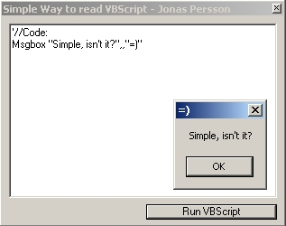



## An easy way to read VBScripts

### Description

This Code reads and follows the VB code in a textbox using "Microsoft Scripting Controls"

(Only one line of code required)

The Ocx file can be found at:

http://msdn.microsoft.com/downloads/default.asp?url=/downloads/sample.asp?url=/MSDN-FILES/027/001/732/msdncompositedoc.xml&frame=true
 
### More Info
 

             |
---                |---
**Submitted On**   |2002-07-19 13:12:24
**By**             |[MrSomeone](https://github.com/Planet-Source-Code/PSCIndex/blob/master/ByAuthor/mrsomeone.md)
**Level**          |Beginner
**User Rating**    |4.6 (32 globes from 7 users)
**Compatibility**  |VB 5\.0, VB 6\.0
**Category**       |[OLE/ COM/ DCOM/ Active\-X](https://github.com/Planet-Source-Code/PSCIndex/blob/master/ByCategory/ole-com-dcom-active-x__1-29.md)
**World**          |[Visual Basic](https://github.com/Planet-Source-Code/PSCIndex/blob/master/ByWorld/visual-basic.md)
**Archive File**   |[An\_easy\_wa1080757192002\.zip](https://github.com/Planet-Source-Code/mrsomeone-an-easy-way-to-read-vbscripts__1-37067/archive/master.zip)

